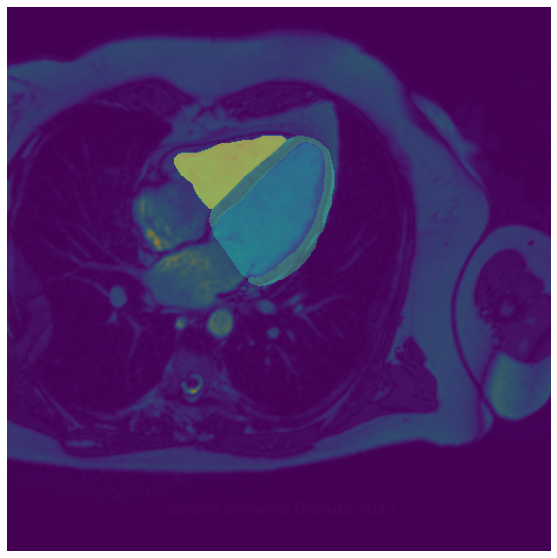
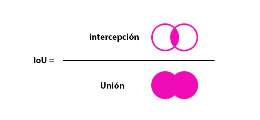
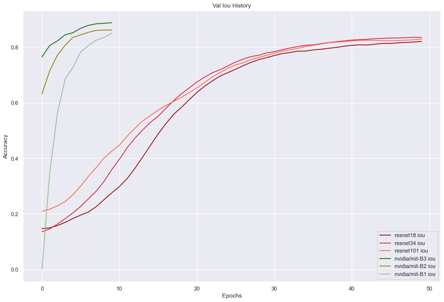

## A plain Comparison: UNet and Transformer



### Resumen

La presente investigación muestra un marco base para hacer comparación de modelos orientados a resolver problemas de segmentación. Está motivado por una intuición que propone a un modelo de Transformer más rápido que una UNet, que es contra intuitivo por la cantidad de poder computacional que se requiere y es una diferencia en ambos modelos. 
Los resultados se inscriben en un marco de decisiones que se argumentan a lo largo de la investigación que no pretenden ser una regla general; pero que sí se ajustan a este tipo de problemas de segmentación.

### Antecedentes

Es común hacer este tipo de comparaciones, y lo más frecuente es comparar modelos de un mismo tipo. Las condiciones para este tipo de investigaciones es mucho más fácil, ya que se enfrentan características similares. Para el caso que les presento, los modelos son diferentes, así que requerirán de muchas iteraciones con diferentes parámetros y datos en diferentes calidades. Todo esto es necesario para determinar un nivel base en el que podamos establecer condiciones justas para ambos modelos.
En la presente investigación no explaya en la definición de estos conceptos básicos para establecer una comparación equilibrada; pero se mencionan algunos criterios a considerar que no pretenden ser la regla general, pero establece el marco que define los límites de la investigación.
En principio el tiempo es un limitante. Habría que considerar, muy cuidadosamente, cuáles serían las variables relevantes que debía mantener para ser riguroso en los resultados y cuales podría omitir o manejar con un grado de libertad para reducir el tiempo de entrenamiento de los modelos. 
El entorno de trabajo también, es un factor importante. Para la investigación he usado Colab y Kaggle. La idea general es que los resultados sean fácilmente replicables, por cualquier persona, sin necesidad de un hardware privativo económicamente.  Ambos entornos tienen pequeñas diferencias; pero en general arrojan resultados similares.

### Warning!

Es importante señalar que para poder usar el código de la presente investigación habrá que tener en cuenta los procedimientos elegidos y modificarlo para obtener los mejores resultados en orden a uno de los modelos. Nuevamente recalco que el objetivo actual es la comparación más que el buen rendimiento. 

### Los datos utilizados

Para emprender esta experiencia he tomado prestado los datos de la competición: Multi-Disease, Multi-View & Multi-Center Right Ventricular Segmentation in Cardiac MRI. 
https://competitions.codalab.org/competitions/31559#learn_the_details
Todas las imágenes requeridas se pueden descargar en este link:
https://www.ub.edu/mnms-2/
Si bien la competición ha terminado, se puede acceder a ellos completando un formulario. Los datos tienen un tamaño total de 4.33GB. Esto se convierte en un inconveniente, considerando la cantidad de veces que se requiere pre-procesar para introducirlos a los modelos que usaremos. Habría que tomar una decisión con relación a los tiempos necesarios para desarrollar estos procesos además de considerar también los términos de la competición. 
En ese sentido he procesado las imágenes respetando la proporción entre el ancho y el alto además de la cantidad de píxeles. Para las máscaras he utilizado una codificación con los siguientes valores:
Fondo: 0
Tipo a: 1
Tipo b: 2
Tipo c: 3
Todas las imágenes las he guardado en formato PNG. Así que no debe causar asombro ver las máscaras totalmente oscuras a simple percepción. Además, estoy usando solamente las imágenes que contienen el objeto de estudio, el corazón, y he descartado aquellas en donde la máscara NO tiene información alguna. Esto ha reducido el set de datos en un 30%. En este punto, es importante señalar que, en un entorno de producción es inviable. No pretendo mostrar el modelo mejor entrenado para este tipo de segmentación, mi objetivo es hacer una comparación y para ello solo requiero que ambos modelos reciban la misma calidad de datos. El lector podrá adaptar el modelo fácilmente, si accede a los datos completos.  


### Los modelos

Tenemos dos modelos diferentes: UNet y Transformer. Lo primero a destacar es que se llevan casi 5 años de diferencia. Las arquitecturas  de tipo Unet han sido diseñadas especialmente para desarrollar segmentación, mientras que, originalmente los Transformer estaban orientadas al desarrollo de NLP(Natural Language Processing).
La diferencia más significativa está orientada en la cantidad de cálculos y necesidad de poder computacional. Obviamente esto dependerá de la cantidad de parámetros que contenga el modelo; pero en general, a una similar cantidad de parámetros, los modelos basados en Transformers requieren mayor capacidad de cálculo. Esto es un problema que debería ser mencionado en el apartado antecedentes; pero requería una explicación más profunda. En este punto me remito a una explicación más adelante.
Los estudios recientes muestran que las potencialidades de los Transformers se orientan, también en otras tareas: clasificación, detección, segmentación. Las capacidades de los mecanismos de atención están proponiendo nuevos campos de uso que no fueron definidos en su diseño y que están siendo explotados por los desarrolladores.

|   __Model__   | __Parámetros__  |   __Val_iou__   |     __Time__    |
|:-------------:|:---------------:|:---------------:|:---------------:|
| nvidia/mit-b1 | 13.7 M          | 0.827           | 24:52 mim       |
| nvidia/mit-b2 | 27.3 M          | 0.856           | 43:15 mim       |
| nvidia/mit-b3 | 47.2 M          | 0.890           | 61:00 mim       |
| resnet18      | 14.3 M          | 0.831           | 19:49 mim       |
| resnet34      | 24.4 M          | 0.830           | 21:35 mim       |
| resnet101     | 51.5 M          | 0.843           | 32:53 mim       |

### Configuración de parámetros

Un buen indicador del rendimiento de los modelos es el tiempo. Esto se puede resumir en la cantidad de tiempo que tarda cada modelo en completar una época (epoch). Completar una época implica alimentar con todos los datos al modelo. Había que definir la cantidad de datos que usaría para alimentar los modelos en cada paso (step). Esta cantidad de datos se denomina lote (batch). Como mencionamos, anteriormente, los modelos difieren en la cantidad de cálculos requeridos para procesar los datos, esto implica que la cantidad de datos se verá limitada por la capacidad de GPU a usar. Para este menester dispusimos usar Colab, que nos provee de un Tesla T4 de 16MB, ese sería nuestro límite de memoria. Los modelos de transformers más pequeños no tendrían problema; pero si los más grandes. Si bien, no usaríamos el modelo más elaborado para hacer las comparaciones, sería muy elocuente mostrar el potencial general del modelo, así que evaluar los datos con el modelo más grande nos daría el límite de tamaño de lote (en este caso 2). Este se mantendría para evaluar los modelos más pequeños. En el caso de la UNet, no tendríamos este problema. Así que usamos el máximo tamaño de lote posible (este sería 64).
En este punto, el argumento estaba orientado a establecer el máximo rendimiento en cada modelo. No sería justo usar un mismo lote para ambos modelos; pero sí mantener el mismo tamaño del lote para la misma arquitectura. Definir el lote en la Unet, no fue muy complicado. no era crítico para el GPU manejar esa cantidad de datos. Este criterio puede ser diferente si se requiere pre-procesar los datos originales. En nuestro caso, el pre-procesado se realizó con anterioridad e implicó un buen ahorro de cálculos, o dicho de otro modo, un inicio más ligero.

Para definir la cantidad de épocas a entrenar, estaba claro que no serían iguales para ambos modelos; pero habría que definir una cantidad fija para cada uno. Decidí usar los modelos más pequeños y establecer un tiempo base para ambos. Después de varios entrenamientos pude establecer un tiempo mínimo de 20 a 22 minutos que correspondía a 50 épocas para la UNet y 9 para el Transformer. Esta cantidad de épocas se mantendría para el resto de entrenamientos. Este parámetro sería muy revelador; pero de ninguna manera define las mejores métricas, para el caso del Transformer es mucho menor y de la UNet podría ser hasta tres veces mayor en combinación de otros hiperparámetros. El lector debería considerar que el objetivo NO es encontrar los mejores valores de rendimiento. Si ese fuera el objetivo, debería prestar atención a estas aclaraciones y realizar las modificaciones respectivas.

Otro de los aspectos definido, fue la omisión de las trasformaciones. Esto debería acelerar los resultados, desde el punto de vista de optimizar el proceso de comparación, esto quiere decir que los procesos de entrenamiento tomen los tiempos más reducidos. En este punto es importante indicar que para llegar a estos criterios se ha tenido que realizar varios entrenamientos que demuestren que, el uso de transformaciones adecuadas para este tipo de problema, no alteran los resultados con relación a las comparaciones. En todo caso, la presente investigación quiere definir un marco base para realizar comparaciones mas no un modelo óptimamente entrenado.

Y en contra posición a lo dicho anterior mente, he añadido un transformador, uno no especialmente importante para este tipo de problemas. Pero después de contrastarlo con los habituales transformadores como son: flip, rotate, transpose, gridDistortion, gaussianBlur. No influían negativamente en los resultados; pero si en los tiempos de entrenamientos y en la cantidad de épocas necesarias para encontrar mejores resultados en competencia con la misma arquitectura (Unet), mas no, en términos comparativos, con la otra arquitectura (transformers).

Además, es también importante la omisión del uso de normalización, que parece ser una omisión contra intuitiva. Pero luego del entrenamiento, resultó que implicaba un mayor tiempo de entrenamiento para obtener mejores métricas, para el caso de la UNet. En este punto debo dejar una interrogación que explique la razón de este comportamiento, el lector deberá investigar más sobre ello.

En resumen, el uso de transformadores, deberán ser usados con el fin de encontrar mejores métricas desvinculadas de esta investigación. Son irrelevantes con relación a objetivos comparativos, que es nuestro caso.

La métrica para evaluar nuestros modelos será intersection over union (iou), que es el cociente entre la intercepción de los resultados y el ground truth con la unión de los mismos. Esta métrica es muy habitual para este tipo de problemas de segmentación. 



Para el desarrollo de esta investigación he usado el código del algoritmo prestado de Sensio; pero hay librerías que permiten implementarlas con solo la evocación. La idea general era entender cómo funcionaba el algoritmo en detrimento del tiempo, obviamente. 

```python
def IoU(pr, gt, th=0.5, eps=1e-7):
    pr = torch.sigmoid(pr) > th
    gt = gt > th
    intersection = torch.sum(gt * pr, axis=(-2,-1))
    union = torch.sum(gt, axis=(-2,-1)) + torch.sum(pr, axis=(-2,-1)) - intersection + eps
    ious = (intersection + eps) / union
    return torch.mean(ious).item()
```

Otra de las decisiones que involucró agilizar el proceso de entrenamiento fue el uso de pytorch-lightning. Esto permitió acelerar el proceso en casi un 60%. Ciertamente esto depende de los modelos y datos; pero se ha convertido en el estándar en entornos de producción.

### Los resultados

En una primera mirada, es muy evidente que, los Transformers son más eficiente que la UNet; pero hay que considerar que No tienen la misma cantidad de parámetros, si bien no es una diferencia notoria se debe considerar que en los modelos más pequeños la UNet tiene una pequeña ventaja. 



En los modelos restantes, los transformers rebasan y mantienen una diferencia considerable.  Además, también hay que resaltar que los modelos basados en Transformers solo requieren un tercio de las épocas para estar por encima de los modelos basados en UNet. Este detalle es muy elocuente, podemos determinar que los Transformers obtienen los mismos resultados en un periodo similar de tiempo comparado a los modelos basados en UNet. Y luego requieren unas pocas épocas para encontrar mejores métricas.


###
###
###
###
